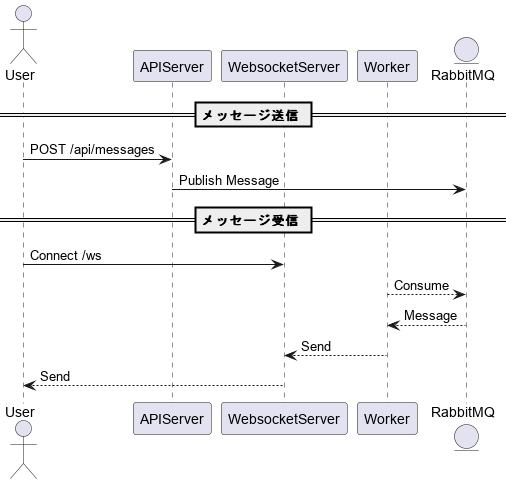

# rabbitmq-websocket-sample
RabbitMQ/websocketの勉強用サンプルアプリ.

揮発だがチャットアプリ的なユーザー間で通信できるやつ.

APIServer経由でRabbitMQにメッセージを貯めて、Workerがメッセージを読みだしてWebsocket server経由でユーザーに送信する.




## ファイル・フォルダ構成
- backend
  - cmd/apiserver
    - APIサーバー
  - cmd/websocketserver
    - Websocketサーバー
    - Worker
- docker-compose.yml
  - RabbitMQ立ち上げ用
- index.html
  - websocketクライアント
    - ユーザー名test1でセッションを保持する

## setup
RabbitMQを起動する
```
docker-compose up -d
docker-compose down
```

バックエンドを起動する.

やり方は`backend/README.md`を参照.


## 動作確認方法
バックエンドを起動したら`index.html`を開いてセッションを開始.

`rest_client/message.rest`でメッセージ送信.

そうすると送信した内容が`index.html`の画面に表示される.
